# 🧱 Highly Available Scalable Web Application on AWS  
### (ASG + ALB + Private Subnets + NAT + SSM Access)

This project demonstrates a **production-grade AWS architecture** where EC2 instances run inside **private subnets** and scale automatically based on demand using an **Auto Scaling Group (ASG)**.  
Traffic is routed through an **Application Load Balancer (ALB)** located in **public subnets**, while instances remain unreachable from the internet for enhanced security.

Instances do **not use public IPs**. Instead, access is provided securely via **AWS Systems Manager Session Manager (SSM)**.

---

## 📁 Repository Structure

```bash
aws-asg-alb-private-ssm/
├── README.md                # Main project guide
├── images/                  # screnshots of creating resources
├── stress-test.sh           # Helper commands for CPU load testing

```
---
## 📌 Architecture Overview

```text
           Internet
               │
               ▼
        ┌───────────────┐
        │  ALB (Public) │
        └───────────────┘
               │
   ┌───────────────────────────┐
   │ Auto Scaling Group (ASG)  │
   │  - EC2 instances (NGINX)  │
   │  - Private subnets (2 AZ) │
   └───────────────────────────┘
               │
        ┌───────────────┐
        │  NAT Gateway  │
        └───────────────┘
               │
           Internet
```

---

## ✔️ Features

| Feature | Enabled |
|--------|---------|
| Auto Scaling Group | ✔ |
| Private EC2 Instances | ✔ |
| ALB in public subnets | ✔ |
| NAT Gateway for outbound internet | ✔ |
| SSM Session Manager (no SSH / no public IP) | ✔ |
| Health checks via Target Group | ✔ |
| Target tracking scaling policy on CPU | ✔ |

---

## 🏗 Prerequisites

- AWS account
- Region selected (e.g., `us-east-1` / `ap-south-1`)
- Basic familiarity with EC2, VPC, and IAM
- IAM permissions to create: VPC, EC2, ALB, IAM roles, SSM

---

## 🚀 Step-by-Step Setup

### 1️⃣ Create VPC

1. Go to **VPC Console → Your VPCs → Create VPC**.
2. Choose **VPC only**.
3. Set:
   - Name: `demo-vpc`
   - IPv4 CIDR: `10.0.0.0/16`
4. Create.

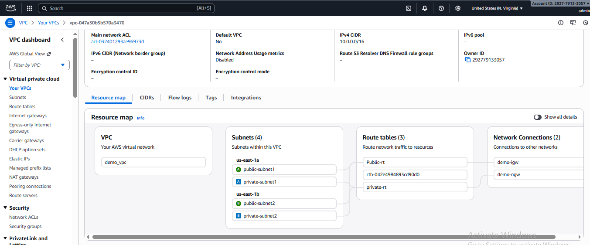

---

### 2️⃣ Create Subnets

Create **4 subnets** in 2 different Availability Zones.

#### Public Subnets (for ALB + NAT)

| Name             | AZ (example) | CIDR         |
|------------------|-------------|--------------|
| `public-subnet-1`| `us-east-1a`| `10.0.1.0/24`|
| `public-subnet-2`| `us-east-1b`| `10.0.2.0/24`|

#### Private Subnets (for ASG instances)

| Name              | AZ (example) | CIDR         |
|-------------------|-------------|--------------|
| `private-subnet-1`| `us-east-1a`| `10.0.3.0/24`|
| `private-subnet-2`| `us-east-1b`| `10.0.4.0/24`|

---

### 3️⃣ Attach an Internet Gateway

1. **VPC → Internet gateways → Create internet gateway**  
   Name: `demo-igw`
2. Select it → **Actions → Attach to VPC → demo-vpc**.

---

### 4️⃣ Create NAT Gateway

1. Go to **Elastic IPs → Allocate Elastic IP address**.
2. Go to **VPC → NAT gateways → Create NAT Gateway**:
   - Name: `demo-nat-gw`
   - Subnet: `public-subnet-1`
   - Elastic IP: select allocated IP
3. Wait until **State: available**.

---

### 5️⃣ Route Tables

#### Public Route Table

1. **Route Tables → Create route table**
   - Name: `public-rt`
   - VPC: `demo-vpc`
2. Routes:
   - `10.0.0.0/16 → local`
   - `0.0.0.0/0 → demo-igw` (Internet Gateway)
3. Subnet associations:
   - Associate `public-subnet-1` and `public-subnet-2`.

#### Private Route Table

1. **Route Tables → Create route table**
   - Name: `private-rt`
   - VPC: `demo-vpc`
2. Routes:
   - `10.0.0.0/16 → local`
   - `0.0.0.0/0 → demo-nat-gw` (NAT Gateway)
3. Subnet associations:
   - Associate `private-subnet-1` and `private-subnet-2`.

Now:
- Public subnets have internet via **IGW**.
- Private subnets have outbound internet via **NAT** but are not directly reachable.

---

### 6️⃣ IAM Role for EC2 (SSM Access)

1. Go to **IAM → Roles → Create role**.
2. Trusted entity: **AWS service → EC2**.
3. Permissions:
   - Attach policy: **AmazonSSMManagedInstanceCore**
4. Name: `EC2-SSM-Role`.
5. Create role.

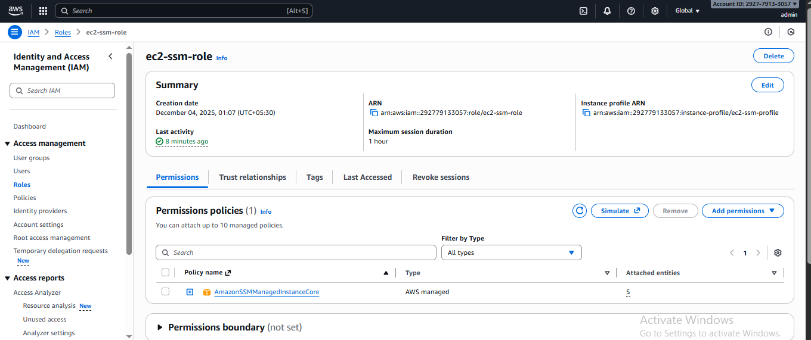

This role allows EC2 instances to register with **Systems Manager**.

---

### 7️⃣ Security Groups

#### ALB Security Group (`sg-alb`)

- VPC: `demo-vpc`
- Inbound rules:
  - HTTP, port 80, source `0.0.0.0/0`
- Outbound: allow all (default).

#### EC2/ASG Security Group (`sg-asg`)

- VPC: `demo-vpc`
- Inbound rules:
  - HTTP, port 80, **source: sg-alb** (reference the ALB SG)
  - (Optional) SSH, port 22, source: your IP `x.x.x.x/32`
- Outbound: allow all.

> Best practice: EC2 instances accept HTTP only from the ALB security group, not from the internet.

---

### 8️⃣ Create Launch Template

1. Go to **EC2 → Launch Templates → Create launch template**.
2. Name: `lt-nginx-private-asg`.
3. AMI: latest **Ubuntu** (20.04/22.04).
4. Instance type: `t3.micro` or `t2.micro`.
5. Key pair: optional (for SSH, not required for SSM).
6. Network settings:
   - Security group: **`sg-asg`**.
7. IAM instance profile: choose **`EC2-SSM-Role`**.

In **Advanced details → User data**, paste:

```bash
#!/bin/bash
exec > /var/log/user-data.log 2>&1

apt-get update -y
apt-get install -y nginx stress

systemctl enable nginx
systemctl start nginx

cat <<EOF > /var/www/html/index.html
<!DOCTYPE html>
<html>
<head><title>ASG + NGINX</title></head>
<body style="font-family:Arial; text-align:center;">
<h2 style="color:green;">Auto Scaling Group with NGINX</h2>
<p>Served from instance: <strong>$(hostname -f)</strong></p>
</body>
</html>
EOF
```

Create the launch template.

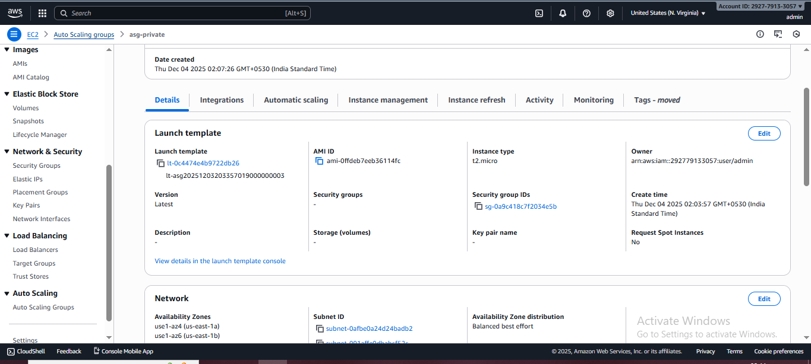

---

### 9️⃣ Create Target Group

1. Go to **EC2 → Target Groups → Create target group**.
2. Target type: **Instances**.
3. Name: `tg-nginx-asg`.
4. Protocol: HTTP, Port: 80.
5. VPC: `demo-vpc`.
6. Health checks:
   - Protocol: HTTP
   - Path: `/`
7. Create target group.

Leave it empty; the ASG will register instances automatically.


---

### 🔟 Create Application Load Balancer (ALB)

1. Go to **EC2 → Load Balancers → Create load balancer** → **Application Load Balancer**.
2. Name: `alb-nginx-public`.
3. Scheme: **Internet-facing**.
4. IP type: IPv4.
5. VPC: `demo-vpc`.
6. Availability Zones:
   - Select `public-subnet-1` and `public-subnet-2`.
7. Security group: select **`sg-alb`**.
8. Listener:
   - HTTP : 80 → default action: **Forward to `tg-nginx-asg`**.
9. Create ALB.

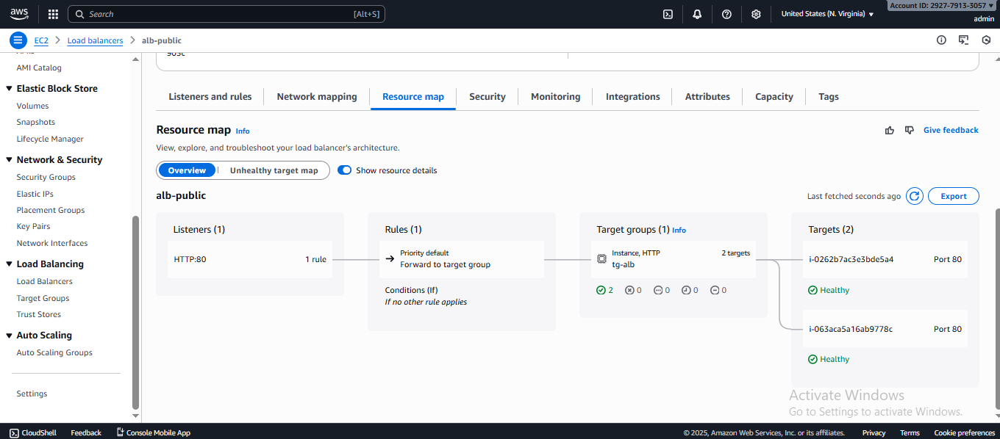

---

### 1️⃣1️⃣ Create Auto Scaling Group (ASG)

1. Go to **EC2 → Auto Scaling Groups → Create Auto Scaling group**.
2. Name: `asg-nginx-private`.
3. Launch template: `lt-nginx-private-asg`.
4. Network:
   - VPC: `demo-vpc`.
   - Subnets: **select only the private subnets** (`private-subnet-1` and `private-subnet-2`).
5. Load balancing:
   - Attach to existing load balancer.
   - Choose `alb-nginx-public` and target group `tg-nginx-asg`.
   - Enable **ELB health checks**.
   - Health check grace period: `120` seconds.
6. Group size:
   - Desired capacity: `2`
   - Minimum capacity: `2`
   - Maximum capacity: `5`
7. Scaling policy:
   - Choose **Target tracking scaling policy**.
   - Metric: **Average CPU utilization**.
   - Target value: **50%**.
8. Create Auto Scaling group.

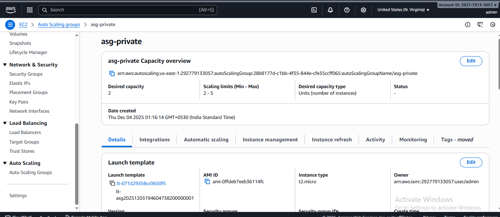

---

## 🔍 Verify Setup

### ✅ 1. Check Instances

Go to **EC2 → Instances**:

- You should see 2 **running** instances.
- They are in **private subnets** (no public IP).

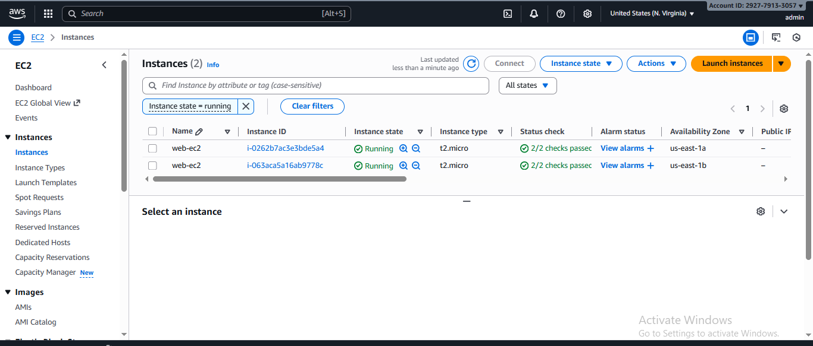

---

### ✅ 2. Check Target Group Health

Go to **EC2 → Target Groups → `tg-nginx-asg` → Targets**:

- Status should become **healthy** for both instances.

If unhealthy:
- Confirm security group rules.
- Confirm NGINX is running.
- Confirm health check path `/`.

---

### ✅ 3. Test via ALB DNS

1. Go to **EC2 → Load Balancers → `alb-nginx-public`**.
2. Copy the **DNS name** (e.g., `alb-nginx-public-123456.us-east-1.elb.amazonaws.com`).
3. Open in your browser:

```text
http://<ALB-DNS-NAME>
```

You should see the HTML page with instance hostname.  
Refresh multiple times → hostname may change → proves load balancing.

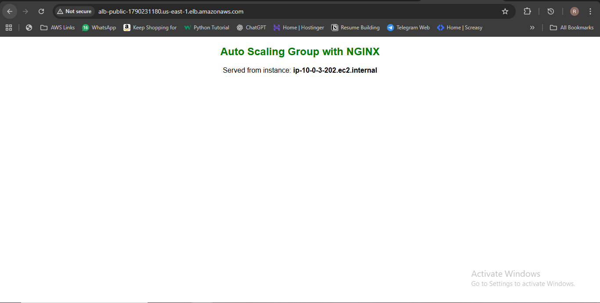

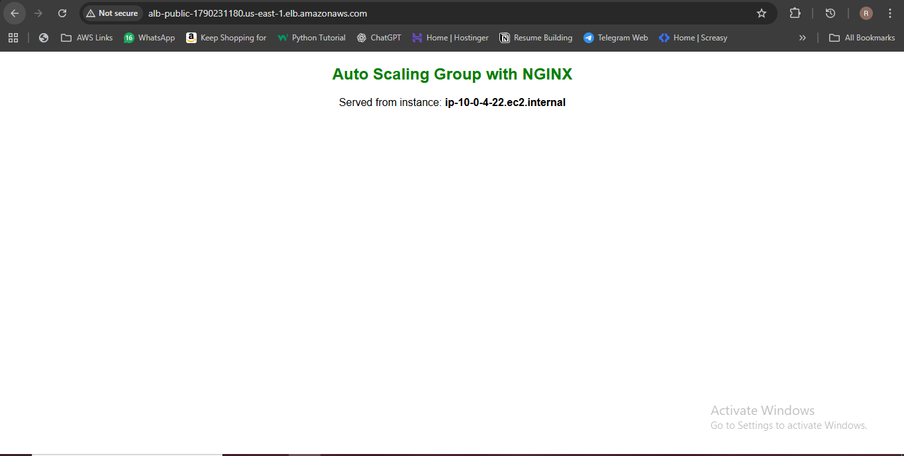

---

## 🔑 Connect to EC2 Instances via SSM (No SSH Needed)

This is **very important** for this lab.

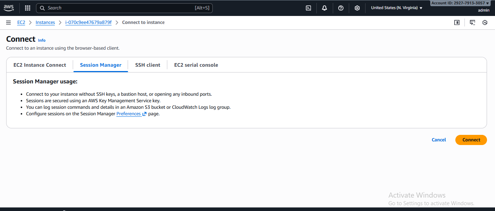

### Requirements Recap

- IAM Role `EC2-SSM-Role` attached to instances (done via Launch Template).
- Instance has outbound internet (via **NAT Gateway**).
- SSM Agent is installed (already in Ubuntu AMIs).

### Steps

1. Go to **AWS Systems Manager → Session Manager**.
2. Click **Start session**.
3. You should see your EC2 instances listed.
4. Select one instance → click **Start session**.

You now have a shell like:

```bash
ubuntu@ip-10-0-3-21:~$
```

#### Test web server locally:

```bash
curl http://localhost
```

You should see your `index.html` content.

#### (Optional) Verify internet access from private subnet:

```bash
ping -c 2 google.com
sudo apt-get update -y
```

If this works, NAT + SSM setup is correct.

---

## 🧪 Auto Scaling Test (CPU-Based)

Use SSM session to generate CPU load:

```bash
stress --cpu 4 --timeout 300
```
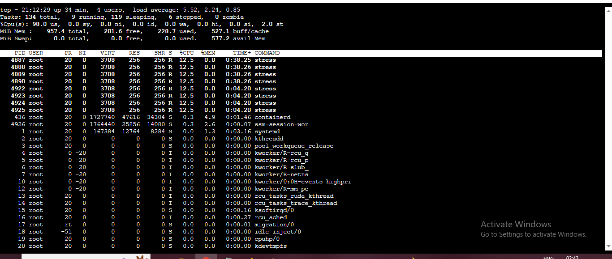

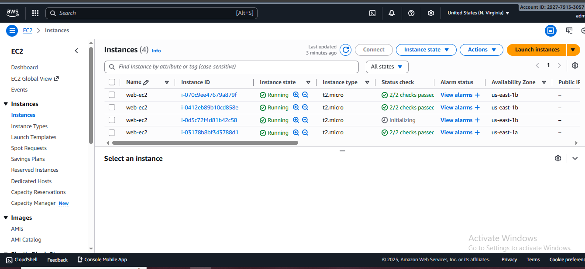

Then:

1. Go to **Auto Scaling Groups → `asg-nginx-private` → Activity**.
2. Watch for **"Launching a new EC2 instance"** events.
3. You should see instance count increase (up to max 5).

After the `stress` command completes and CPU drops:

- ASG will gradually scale in (terminate extra instances) back to **min = 2**.

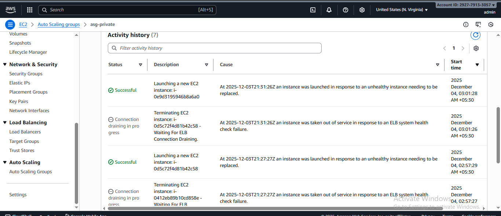
---

## 🧹 Cleanup

To avoid charges (especially NAT + ALB):

1. Delete the **Auto Scaling Group**.
2. Delete the **ALB**.
3. Delete the **Target Group**.
4. Delete the **NAT Gateway** (this has hourly + data costs).
5. Release the **Elastic IP**.
6. Delete subnets, route tables, internet gateway.
7. Finally, delete the **VPC**.

---

